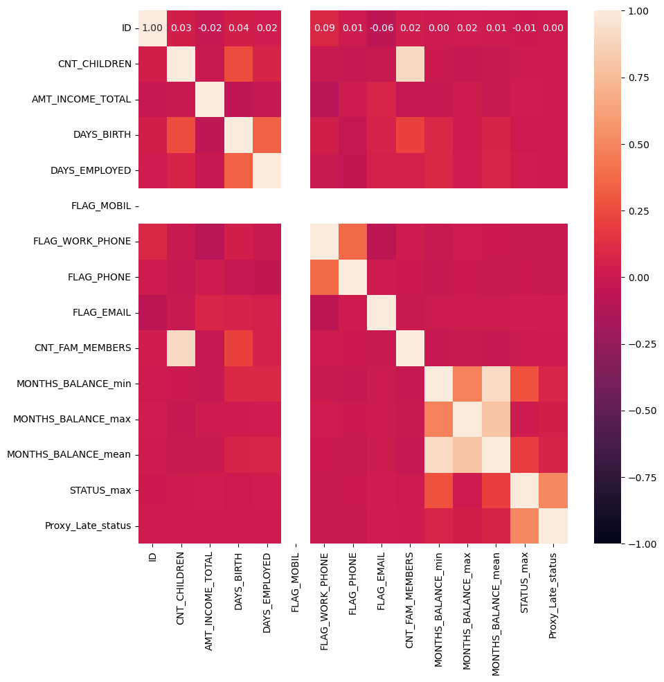
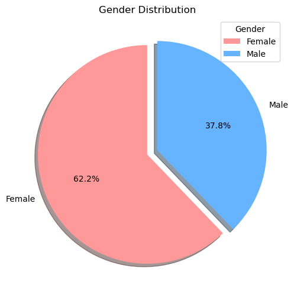
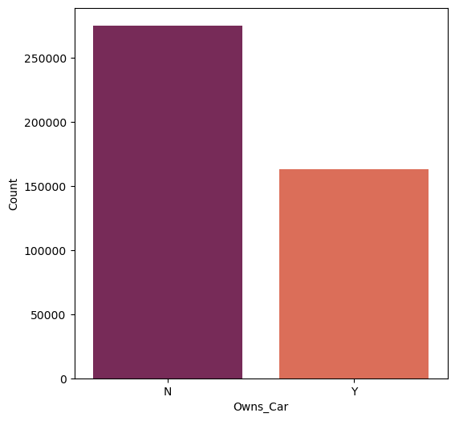
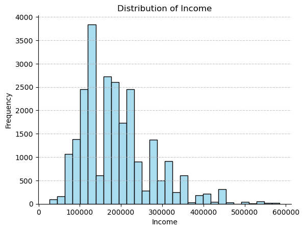
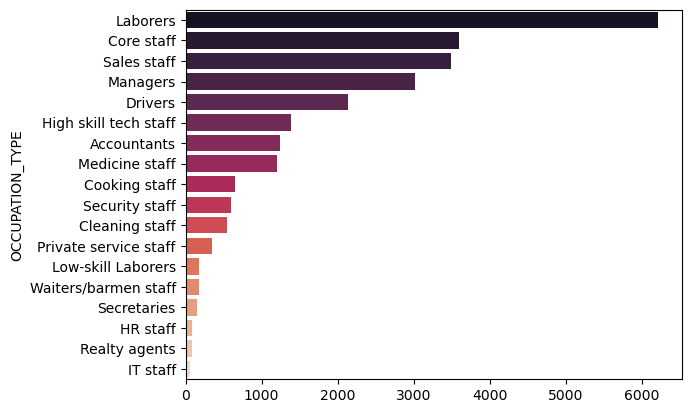
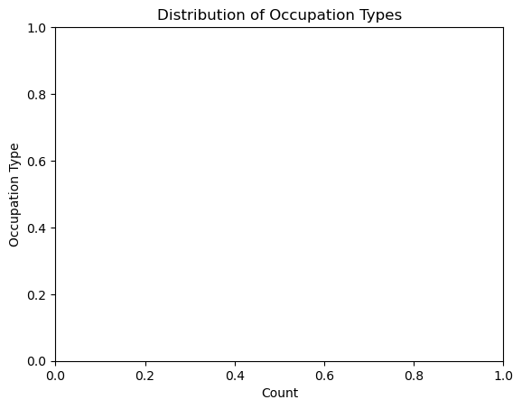

```python
"""PythonProject__DataExploration&PreProccessing.ipynb

Automatically generated by Colab.

Original file is located at
    https://colab.research.google.com/drive/1Nsd3R2VJf-hhRVj6Jk5g-HXynDeAm2jE
"""
```


    'PythonProject__DataExploration&PreProccessing.ipynb\n\nAutomatically generated by Colab.\n\nOriginal file is located at\n    https://colab.research.google.com/drive/1Nsd3R2VJf-hhRVj6Jk5g-HXynDeAm2jE\n'


```python
import pandas as pd
import numpy as np
import matplotlib.pyplot as plt
from datetime import timedelta
from scipy.stats import norm
import math
import seaborn as sns
import statsmodels.api as sm
from sklearn import datasets
from sklearn.model_selection import train_test_split
from sklearn.preprocessing import StandardScaler
from sklearn.linear_model import LogisticRegression
from scipy.stats import randint
from scipy.stats import uniform
from io import StringIO
from sklearn.impute import SimpleImputer
```


```python
myDF0 = pd.read_csv("/Users/underdz/Documents/spring 2024/DSP/group project/archive/application_record.csv")
myDF1 = pd.read_csv("/Users/underdz/Documents/spring 2024/DSP/group project/archive/credit_record.csv")
```


```python
print(myDF0.columns)
print(myDF1.columns)
```

    Index(['ID', 'CODE_GENDER', 'FLAG_OWN_CAR', 'FLAG_OWN_REALTY', 'CNT_CHILDREN',
           'AMT_INCOME_TOTAL', 'NAME_INCOME_TYPE', 'NAME_EDUCATION_TYPE',
           'NAME_FAMILY_STATUS', 'NAME_HOUSING_TYPE', 'DAYS_BIRTH',
           'DAYS_EMPLOYED', 'FLAG_MOBIL', 'FLAG_WORK_PHONE', 'FLAG_PHONE',
           'FLAG_EMAIL', 'OCCUPATION_TYPE', 'CNT_FAM_MEMBERS'],
          dtype='object')
    Index(['ID', 'MONTHS_BALANCE', 'STATUS'], dtype='object')


```python
myDF0.head()
```


<div>
<style scoped>
    .dataframe tbody tr th:only-of-type {
        vertical-align: middle;
    }

    .dataframe tbody tr th {
        vertical-align: top;
    }

    .dataframe thead th {
        text-align: right;
    }
</style>
<table border="1" class="dataframe">
  <thead>
    <tr style="text-align: right;">
      <th></th>
      <th>ID</th>
      <th>CODE_GENDER</th>
      <th>FLAG_OWN_CAR</th>
      <th>FLAG_OWN_REALTY</th>
      <th>CNT_CHILDREN</th>
      <th>AMT_INCOME_TOTAL</th>
      <th>NAME_INCOME_TYPE</th>
      <th>NAME_EDUCATION_TYPE</th>
      <th>NAME_FAMILY_STATUS</th>
      <th>NAME_HOUSING_TYPE</th>
      <th>DAYS_BIRTH</th>
      <th>DAYS_EMPLOYED</th>
      <th>FLAG_MOBIL</th>
      <th>FLAG_WORK_PHONE</th>
      <th>FLAG_PHONE</th>
      <th>FLAG_EMAIL</th>
      <th>OCCUPATION_TYPE</th>
      <th>CNT_FAM_MEMBERS</th>
    </tr>
  </thead>
  <tbody>
    <tr>
      <th>0</th>
      <td>5008804</td>
      <td>M</td>
      <td>Y</td>
      <td>Y</td>
      <td>0</td>
      <td>427500.0</td>
      <td>Working</td>
      <td>Higher education</td>
      <td>Civil marriage</td>
      <td>Rented apartment</td>
      <td>-12005</td>
      <td>-4542</td>
      <td>1</td>
      <td>1</td>
      <td>0</td>
      <td>0</td>
      <td>NaN</td>
      <td>2.0</td>
    </tr>
    <tr>
      <th>1</th>
      <td>5008805</td>
      <td>M</td>
      <td>Y</td>
      <td>Y</td>
      <td>0</td>
      <td>427500.0</td>
      <td>Working</td>
      <td>Higher education</td>
      <td>Civil marriage</td>
      <td>Rented apartment</td>
      <td>-12005</td>
      <td>-4542</td>
      <td>1</td>
      <td>1</td>
      <td>0</td>
      <td>0</td>
      <td>NaN</td>
      <td>2.0</td>
    </tr>
    <tr>
      <th>2</th>
      <td>5008806</td>
      <td>M</td>
      <td>Y</td>
      <td>Y</td>
      <td>0</td>
      <td>112500.0</td>
      <td>Working</td>
      <td>Secondary / secondary special</td>
      <td>Married</td>
      <td>House / apartment</td>
      <td>-21474</td>
      <td>-1134</td>
      <td>1</td>
      <td>0</td>
      <td>0</td>
      <td>0</td>
      <td>Security staff</td>
      <td>2.0</td>
    </tr>
    <tr>
      <th>3</th>
      <td>5008808</td>
      <td>F</td>
      <td>N</td>
      <td>Y</td>
      <td>0</td>
      <td>270000.0</td>
      <td>Commercial associate</td>
      <td>Secondary / secondary special</td>
      <td>Single / not married</td>
      <td>House / apartment</td>
      <td>-19110</td>
      <td>-3051</td>
      <td>1</td>
      <td>0</td>
      <td>1</td>
      <td>1</td>
      <td>Sales staff</td>
      <td>1.0</td>
    </tr>
    <tr>
      <th>4</th>
      <td>5008809</td>
      <td>F</td>
      <td>N</td>
      <td>Y</td>
      <td>0</td>
      <td>270000.0</td>
      <td>Commercial associate</td>
      <td>Secondary / secondary special</td>
      <td>Single / not married</td>
      <td>House / apartment</td>
      <td>-19110</td>
      <td>-3051</td>
      <td>1</td>
      <td>0</td>
      <td>1</td>
      <td>1</td>
      <td>Sales staff</td>
      <td>1.0</td>
    </tr>
  </tbody>
</table>
</div>


```python
myDF1.head()
```


<div>
<style scoped>
    .dataframe tbody tr th:only-of-type {
        vertical-align: middle;
    }

    .dataframe tbody tr th {
        vertical-align: top;
    }

    .dataframe thead th {
        text-align: right;
    }
</style>
<table border="1" class="dataframe">
  <thead>
    <tr style="text-align: right;">
      <th></th>
      <th>ID</th>
      <th>MONTHS_BALANCE</th>
      <th>STATUS</th>
    </tr>
  </thead>
  <tbody>
    <tr>
      <th>0</th>
      <td>5001711</td>
      <td>0</td>
      <td>X</td>
    </tr>
    <tr>
      <th>1</th>
      <td>5001711</td>
      <td>-1</td>
      <td>0</td>
    </tr>
    <tr>
      <th>2</th>
      <td>5001711</td>
      <td>-2</td>
      <td>0</td>
    </tr>
    <tr>
      <th>3</th>
      <td>5001711</td>
      <td>-3</td>
      <td>0</td>
    </tr>
    <tr>
      <th>4</th>
      <td>5001712</td>
      <td>0</td>
      <td>C</td>
    </tr>
  </tbody>
</table>
</div>


```python
myDF0.info()
```

    <class 'pandas.core.frame.DataFrame'>
    RangeIndex: 438557 entries, 0 to 438556
    Data columns (total 18 columns):
     #   Column               Non-Null Count   Dtype  
    ---  ------               --------------   -----  
     0   ID                   438557 non-null  int64  
     1   CODE_GENDER          438557 non-null  object 
     2   FLAG_OWN_CAR         438557 non-null  object 
     3   FLAG_OWN_REALTY      438557 non-null  object 
     4   CNT_CHILDREN         438557 non-null  int64  
     5   AMT_INCOME_TOTAL     438557 non-null  float64
     6   NAME_INCOME_TYPE     438557 non-null  object 
     7   NAME_EDUCATION_TYPE  438557 non-null  object 
     8   NAME_FAMILY_STATUS   438557 non-null  object 
     9   NAME_HOUSING_TYPE    438557 non-null  object 
     10  DAYS_BIRTH           438557 non-null  int64  
     11  DAYS_EMPLOYED        438557 non-null  int64  
     12  FLAG_MOBIL           438557 non-null  int64  
     13  FLAG_WORK_PHONE      438557 non-null  int64  
     14  FLAG_PHONE           438557 non-null  int64  
     15  FLAG_EMAIL           438557 non-null  int64  
     16  OCCUPATION_TYPE      304354 non-null  object 
     17  CNT_FAM_MEMBERS      438557 non-null  float64
    dtypes: float64(2), int64(8), object(8)
    memory usage: 60.2+ MB


```python
myDF1.info()
```

    <class 'pandas.core.frame.DataFrame'>
    RangeIndex: 1048575 entries, 0 to 1048574
    Data columns (total 3 columns):
     #   Column          Non-Null Count    Dtype 
    ---  ------          --------------    ----- 
     0   ID              1048575 non-null  int64 
     1   MONTHS_BALANCE  1048575 non-null  int64 
     2   STATUS          1048575 non-null  object
    dtypes: int64(2), object(1)
    memory usage: 24.0+ MB


```python
myDF0.describe()
```


<div>
<style scoped>
    .dataframe tbody tr th:only-of-type {
        vertical-align: middle;
    }

    .dataframe tbody tr th {
        vertical-align: top;
    }

    .dataframe thead th {
        text-align: right;
    }
</style>
<table border="1" class="dataframe">
  <thead>
    <tr style="text-align: right;">
      <th></th>
      <th>ID</th>
      <th>CNT_CHILDREN</th>
      <th>AMT_INCOME_TOTAL</th>
      <th>DAYS_BIRTH</th>
      <th>DAYS_EMPLOYED</th>
      <th>FLAG_MOBIL</th>
      <th>FLAG_WORK_PHONE</th>
      <th>FLAG_PHONE</th>
      <th>FLAG_EMAIL</th>
      <th>CNT_FAM_MEMBERS</th>
    </tr>
  </thead>
  <tbody>
    <tr>
      <th>count</th>
      <td>4.385570e+05</td>
      <td>438557.000000</td>
      <td>4.385570e+05</td>
      <td>438557.000000</td>
      <td>438557.000000</td>
      <td>438557.0</td>
      <td>438557.000000</td>
      <td>438557.000000</td>
      <td>438557.000000</td>
      <td>438557.000000</td>
    </tr>
    <tr>
      <th>mean</th>
      <td>6.022176e+06</td>
      <td>0.427390</td>
      <td>1.875243e+05</td>
      <td>-15997.904649</td>
      <td>60563.675328</td>
      <td>1.0</td>
      <td>0.206133</td>
      <td>0.287771</td>
      <td>0.108207</td>
      <td>2.194465</td>
    </tr>
    <tr>
      <th>std</th>
      <td>5.716370e+05</td>
      <td>0.724882</td>
      <td>1.100869e+05</td>
      <td>4185.030007</td>
      <td>138767.799647</td>
      <td>0.0</td>
      <td>0.404527</td>
      <td>0.452724</td>
      <td>0.310642</td>
      <td>0.897207</td>
    </tr>
    <tr>
      <th>min</th>
      <td>5.008804e+06</td>
      <td>0.000000</td>
      <td>2.610000e+04</td>
      <td>-25201.000000</td>
      <td>-17531.000000</td>
      <td>1.0</td>
      <td>0.000000</td>
      <td>0.000000</td>
      <td>0.000000</td>
      <td>1.000000</td>
    </tr>
    <tr>
      <th>25%</th>
      <td>5.609375e+06</td>
      <td>0.000000</td>
      <td>1.215000e+05</td>
      <td>-19483.000000</td>
      <td>-3103.000000</td>
      <td>1.0</td>
      <td>0.000000</td>
      <td>0.000000</td>
      <td>0.000000</td>
      <td>2.000000</td>
    </tr>
    <tr>
      <th>50%</th>
      <td>6.047745e+06</td>
      <td>0.000000</td>
      <td>1.607805e+05</td>
      <td>-15630.000000</td>
      <td>-1467.000000</td>
      <td>1.0</td>
      <td>0.000000</td>
      <td>0.000000</td>
      <td>0.000000</td>
      <td>2.000000</td>
    </tr>
    <tr>
      <th>75%</th>
      <td>6.456971e+06</td>
      <td>1.000000</td>
      <td>2.250000e+05</td>
      <td>-12514.000000</td>
      <td>-371.000000</td>
      <td>1.0</td>
      <td>0.000000</td>
      <td>1.000000</td>
      <td>0.000000</td>
      <td>3.000000</td>
    </tr>
    <tr>
      <th>max</th>
      <td>7.999952e+06</td>
      <td>19.000000</td>
      <td>6.750000e+06</td>
      <td>-7489.000000</td>
      <td>365243.000000</td>
      <td>1.0</td>
      <td>1.000000</td>
      <td>1.000000</td>
      <td>1.000000</td>
      <td>20.000000</td>
    </tr>
  </tbody>
</table>
</div>


```python
myDF1.describe()
```


<div>
<style scoped>
    .dataframe tbody tr th:only-of-type {
        vertical-align: middle;
    }

    .dataframe tbody tr th {
        vertical-align: top;
    }

    .dataframe thead th {
        text-align: right;
    }
</style>
<table border="1" class="dataframe">
  <thead>
    <tr style="text-align: right;">
      <th></th>
      <th>ID</th>
      <th>MONTHS_BALANCE</th>
    </tr>
  </thead>
  <tbody>
    <tr>
      <th>count</th>
      <td>1.048575e+06</td>
      <td>1.048575e+06</td>
    </tr>
    <tr>
      <th>mean</th>
      <td>5.068286e+06</td>
      <td>-1.913700e+01</td>
    </tr>
    <tr>
      <th>std</th>
      <td>4.615058e+04</td>
      <td>1.402350e+01</td>
    </tr>
    <tr>
      <th>min</th>
      <td>5.001711e+06</td>
      <td>-6.000000e+01</td>
    </tr>
    <tr>
      <th>25%</th>
      <td>5.023644e+06</td>
      <td>-2.900000e+01</td>
    </tr>
    <tr>
      <th>50%</th>
      <td>5.062104e+06</td>
      <td>-1.700000e+01</td>
    </tr>
    <tr>
      <th>75%</th>
      <td>5.113856e+06</td>
      <td>-7.000000e+00</td>
    </tr>
    <tr>
      <th>max</th>
      <td>5.150487e+06</td>
      <td>0.000000e+00</td>
    </tr>
  </tbody>
</table>
</div>


```python
# Example: Aggregating multiple credit records for each ID
agg_rules = {
    'MONTHS_BALANCE': ['min', 'max', 'mean'],  # Numeric column example
    'STATUS': ['max']  # Categorical column example, assuming 'STATUS' indicates delinquency level
}
credit_summary = myDF1.groupby('ID').agg(agg_rules).reset_index()
# Flatten MultiIndex in columns
credit_summary.columns = ['_'.join(col).strip() for col in credit_summary.columns.values]
```


```python
print(credit_summary.columns)
```

    Index(['ID_', 'MONTHS_BALANCE_min', 'MONTHS_BALANCE_max',
           'MONTHS_BALANCE_mean', 'STATUS_max'],
          dtype='object')


```python
credit_summary.head()
```


<div>
<style scoped>
    .dataframe tbody tr th:only-of-type {
        vertical-align: middle;
    }

    .dataframe tbody tr th {
        vertical-align: top;
    }

    .dataframe thead th {
        text-align: right;
    }
</style>
<table border="1" class="dataframe">
  <thead>
    <tr style="text-align: right;">
      <th></th>
      <th>ID_</th>
      <th>MONTHS_BALANCE_min</th>
      <th>MONTHS_BALANCE_max</th>
      <th>MONTHS_BALANCE_mean</th>
      <th>STATUS_max</th>
    </tr>
  </thead>
  <tbody>
    <tr>
      <th>0</th>
      <td>5001711</td>
      <td>-3</td>
      <td>0</td>
      <td>-1.5</td>
      <td>X</td>
    </tr>
    <tr>
      <th>1</th>
      <td>5001712</td>
      <td>-18</td>
      <td>0</td>
      <td>-9.0</td>
      <td>C</td>
    </tr>
    <tr>
      <th>2</th>
      <td>5001713</td>
      <td>-21</td>
      <td>0</td>
      <td>-10.5</td>
      <td>X</td>
    </tr>
    <tr>
      <th>3</th>
      <td>5001714</td>
      <td>-14</td>
      <td>0</td>
      <td>-7.0</td>
      <td>X</td>
    </tr>
    <tr>
      <th>4</th>
      <td>5001715</td>
      <td>-59</td>
      <td>0</td>
      <td>-29.5</td>
      <td>X</td>
    </tr>
  </tbody>
</table>
</div>


```python
# Renaming 'ID_' to 'ID' for consistency before merging
credit_summary.rename(columns={'ID_': 'ID'}, inplace=True)
```


```python
myDF2 = myDF0.merge(credit_summary, how = 'left', on = ['ID'])
```


```python
print(myDF2.columns)
```

    Index(['ID', 'CODE_GENDER', 'FLAG_OWN_CAR', 'FLAG_OWN_REALTY', 'CNT_CHILDREN',
           'AMT_INCOME_TOTAL', 'NAME_INCOME_TYPE', 'NAME_EDUCATION_TYPE',
           'NAME_FAMILY_STATUS', 'NAME_HOUSING_TYPE', 'DAYS_BIRTH',
           'DAYS_EMPLOYED', 'FLAG_MOBIL', 'FLAG_WORK_PHONE', 'FLAG_PHONE',
           'FLAG_EMAIL', 'OCCUPATION_TYPE', 'CNT_FAM_MEMBERS',
           'MONTHS_BALANCE_min', 'MONTHS_BALANCE_max', 'MONTHS_BALANCE_mean',
           'STATUS_max'],
          dtype='object')


```python
myDF2.isnull().sum()
```


    ID                          0
    CODE_GENDER                 0
    FLAG_OWN_CAR                0
    FLAG_OWN_REALTY             0
    CNT_CHILDREN                0
    AMT_INCOME_TOTAL            0
    NAME_INCOME_TYPE            0
    NAME_EDUCATION_TYPE         0
    NAME_FAMILY_STATUS          0
    NAME_HOUSING_TYPE           0
    DAYS_BIRTH                  0
    DAYS_EMPLOYED               0
    FLAG_MOBIL                  0
    FLAG_WORK_PHONE             0
    FLAG_PHONE                  0
    FLAG_EMAIL                  0
    OCCUPATION_TYPE        134203
    CNT_FAM_MEMBERS             0
    MONTHS_BALANCE_min     402100
    MONTHS_BALANCE_max     402100
    MONTHS_BALANCE_mean    402100
    STATUS_max             402100
    dtype: int64


```python
myDF2 = myDF2.dropna()
```


```python
myDF2.isnull().sum()
```


    ID                     0
    CODE_GENDER            0
    FLAG_OWN_CAR           0
    FLAG_OWN_REALTY        0
    CNT_CHILDREN           0
    AMT_INCOME_TOTAL       0
    NAME_INCOME_TYPE       0
    NAME_EDUCATION_TYPE    0
    NAME_FAMILY_STATUS     0
    NAME_HOUSING_TYPE      0
    DAYS_BIRTH             0
    DAYS_EMPLOYED          0
    FLAG_MOBIL             0
    FLAG_WORK_PHONE        0
    FLAG_PHONE             0
    FLAG_EMAIL             0
    OCCUPATION_TYPE        0
    CNT_FAM_MEMBERS        0
    MONTHS_BALANCE_min     0
    MONTHS_BALANCE_max     0
    MONTHS_BALANCE_mean    0
    STATUS_max             0
    dtype: int64


```python
myDF2.describe()
```


<div>
<style scoped>
    .dataframe tbody tr th:only-of-type {
        vertical-align: middle;
    }

    .dataframe tbody tr th {
        vertical-align: top;
    }

    .dataframe thead th {
        text-align: right;
    }
</style>
<table border="1" class="dataframe">
  <thead>
    <tr style="text-align: right;">
      <th></th>
      <th>ID</th>
      <th>CNT_CHILDREN</th>
      <th>AMT_INCOME_TOTAL</th>
      <th>DAYS_BIRTH</th>
      <th>DAYS_EMPLOYED</th>
      <th>FLAG_MOBIL</th>
      <th>FLAG_WORK_PHONE</th>
      <th>FLAG_PHONE</th>
      <th>FLAG_EMAIL</th>
      <th>CNT_FAM_MEMBERS</th>
      <th>MONTHS_BALANCE_min</th>
      <th>MONTHS_BALANCE_max</th>
      <th>MONTHS_BALANCE_mean</th>
    </tr>
  </thead>
  <tbody>
    <tr>
      <th>count</th>
      <td>2.513400e+04</td>
      <td>25134.000000</td>
      <td>2.513400e+04</td>
      <td>25134.000000</td>
      <td>25134.000000</td>
      <td>25134.0</td>
      <td>25134.000000</td>
      <td>25134.000000</td>
      <td>25134.000000</td>
      <td>25134.000000</td>
      <td>25134.000000</td>
      <td>25134.000000</td>
      <td>25134.000000</td>
    </tr>
    <tr>
      <th>mean</th>
      <td>5.078838e+06</td>
      <td>0.512334</td>
      <td>1.948339e+05</td>
      <td>-14794.037638</td>
      <td>-2624.940877</td>
      <td>1.0</td>
      <td>0.273812</td>
      <td>0.292791</td>
      <td>0.100660</td>
      <td>2.294064</td>
      <td>-26.120594</td>
      <td>-5.728575</td>
      <td>-15.924584</td>
    </tr>
    <tr>
      <th>std</th>
      <td>4.194102e+04</td>
      <td>0.787785</td>
      <td>1.045110e+05</td>
      <td>3486.969790</td>
      <td>2339.224822</td>
      <td>0.0</td>
      <td>0.445923</td>
      <td>0.455052</td>
      <td>0.300885</td>
      <td>0.947590</td>
      <td>16.439658</td>
      <td>11.207963</td>
      <td>11.947805</td>
    </tr>
    <tr>
      <th>min</th>
      <td>5.008806e+06</td>
      <td>0.000000</td>
      <td>2.700000e+04</td>
      <td>-24611.000000</td>
      <td>-15713.000000</td>
      <td>1.0</td>
      <td>0.000000</td>
      <td>0.000000</td>
      <td>0.000000</td>
      <td>1.000000</td>
      <td>-60.000000</td>
      <td>-59.000000</td>
      <td>-59.500000</td>
    </tr>
    <tr>
      <th>25%</th>
      <td>5.042228e+06</td>
      <td>0.000000</td>
      <td>1.350000e+05</td>
      <td>-17438.000000</td>
      <td>-3484.000000</td>
      <td>1.0</td>
      <td>0.000000</td>
      <td>0.000000</td>
      <td>0.000000</td>
      <td>2.000000</td>
      <td>-39.000000</td>
      <td>-6.000000</td>
      <td>-23.000000</td>
    </tr>
    <tr>
      <th>50%</th>
      <td>5.079004e+06</td>
      <td>0.000000</td>
      <td>1.800000e+05</td>
      <td>-14547.000000</td>
      <td>-1942.000000</td>
      <td>1.0</td>
      <td>0.000000</td>
      <td>0.000000</td>
      <td>0.000000</td>
      <td>2.000000</td>
      <td>-24.000000</td>
      <td>0.000000</td>
      <td>-13.500000</td>
    </tr>
    <tr>
      <th>75%</th>
      <td>5.115604e+06</td>
      <td>1.000000</td>
      <td>2.250000e+05</td>
      <td>-11964.000000</td>
      <td>-979.000000</td>
      <td>1.0</td>
      <td>1.000000</td>
      <td>1.000000</td>
      <td>0.000000</td>
      <td>3.000000</td>
      <td>-12.000000</td>
      <td>0.000000</td>
      <td>-6.000000</td>
    </tr>
    <tr>
      <th>max</th>
      <td>5.150487e+06</td>
      <td>19.000000</td>
      <td>1.575000e+06</td>
      <td>-7489.000000</td>
      <td>-17.000000</td>
      <td>1.0</td>
      <td>1.000000</td>
      <td>1.000000</td>
      <td>1.000000</td>
      <td>20.000000</td>
      <td>0.000000</td>
      <td>0.000000</td>
      <td>0.000000</td>
    </tr>
  </tbody>
</table>
</div>


```python
myDF2.info()
```

    <class 'pandas.core.frame.DataFrame'>
    Index: 25134 entries, 2 to 434812
    Data columns (total 22 columns):
     #   Column               Non-Null Count  Dtype  
    ---  ------               --------------  -----  
     0   ID                   25134 non-null  int64  
     1   CODE_GENDER          25134 non-null  object 
     2   FLAG_OWN_CAR         25134 non-null  object 
     3   FLAG_OWN_REALTY      25134 non-null  object 
     4   CNT_CHILDREN         25134 non-null  int64  
     5   AMT_INCOME_TOTAL     25134 non-null  float64
     6   NAME_INCOME_TYPE     25134 non-null  object 
     7   NAME_EDUCATION_TYPE  25134 non-null  object 
     8   NAME_FAMILY_STATUS   25134 non-null  object 
     9   NAME_HOUSING_TYPE    25134 non-null  object 
     10  DAYS_BIRTH           25134 non-null  int64  
     11  DAYS_EMPLOYED        25134 non-null  int64  
     12  FLAG_MOBIL           25134 non-null  int64  
     13  FLAG_WORK_PHONE      25134 non-null  int64  
     14  FLAG_PHONE           25134 non-null  int64  
     15  FLAG_EMAIL           25134 non-null  int64  
     16  OCCUPATION_TYPE      25134 non-null  object 
     17  CNT_FAM_MEMBERS      25134 non-null  float64
     18  MONTHS_BALANCE_min   25134 non-null  float64
     19  MONTHS_BALANCE_max   25134 non-null  float64
     20  MONTHS_BALANCE_mean  25134 non-null  float64
     21  STATUS_max           25134 non-null  object 
    dtypes: float64(5), int64(8), object(9)
    memory usage: 4.4+ MB


```python
size_mapping = {
'5': 7,
'4': 6,
'3': 5,
'2': 4,
'1': 3,
'0': 2,
'X': 1,
'C': 0
}
myDF2['STATUS_max'] = myDF2['STATUS_max'].map(size_mapping)
```


```python
myDF2['Proxy_Late_status'] = (myDF2['STATUS_max'] >= 3).astype(int)
```


```python
X_categorical = pd.get_dummies(myDF2[['CODE_GENDER', 'FLAG_OWN_CAR', 'FLAG_OWN_REALTY', 'NAME_EDUCATION_TYPE', 'NAME_FAMILY_STATUS', 'NAME_HOUSING_TYPE']])
X_numerical = myDF2[['CNT_CHILDREN', 'AMT_INCOME_TOTAL']]
```


```python
X = pd.concat([X_numerical, X_categorical], axis=1)
y = myDF2.Proxy_Late_status
```


```python
from sklearn.model_selection import train_test_split
```


```python
X_train, X_test, y_train, y_test = train_test_split(
    X, y, test_size=0.3, random_state=0)
```


```python
from sklearn.preprocessing import StandardScaler
```


```python
sc = StandardScaler()
sc.fit(X_train)
X_train_std = sc.transform(X_train)
X_test_std = sc.transform(X_test)
```


```python
from sklearn.ensemble import RandomForestClassifier
feat_labels = X.columns
forest = RandomForestClassifier(n_estimators=10,
                                random_state=0,
                                n_jobs=-1)
forest.fit(X_train, y_train)
importances = forest.feature_importances_
indices = np.argsort(importances)[::-1]
```


```python
# Slide 50: Printing out features
for f in range(X_train.shape[1]):
    print("%2d) %-*s %f" % (f + 1, 30,
                            feat_labels[indices[f]],
                            importances[indices[f]]))
```

     1) AMT_INCOME_TOTAL               0.611968
     2) CNT_CHILDREN                   0.121020
     3) NAME_FAMILY_STATUS_Civil marriage 0.023482
     4) FLAG_OWN_REALTY_Y              0.022227
     5) NAME_FAMILY_STATUS_Married     0.019352
     6) FLAG_OWN_CAR_Y                 0.019219
     7) FLAG_OWN_REALTY_N              0.018928
     8) NAME_EDUCATION_TYPE_Higher education 0.017453
     9) NAME_FAMILY_STATUS_Single / not married 0.017436
    10) NAME_FAMILY_STATUS_Widow       0.015358
    11) NAME_EDUCATION_TYPE_Secondary / secondary special 0.015273
    12) FLAG_OWN_CAR_N                 0.013906
    13) NAME_FAMILY_STATUS_Separated   0.012502
    14) NAME_HOUSING_TYPE_Municipal apartment 0.012250
    15) NAME_HOUSING_TYPE_With parents 0.012155
    16) NAME_HOUSING_TYPE_House / apartment 0.011227
    17) CODE_GENDER_F                  0.008638
    18) CODE_GENDER_M                  0.007221
    19) NAME_EDUCATION_TYPE_Incomplete higher 0.006447
    20) NAME_HOUSING_TYPE_Office apartment 0.006429
    21) NAME_HOUSING_TYPE_Rented apartment 0.004973
    22) NAME_EDUCATION_TYPE_Lower secondary 0.001254
    23) NAME_HOUSING_TYPE_Co-op apartment 0.001176
    24) NAME_EDUCATION_TYPE_Academic degree 0.000106


```python
print(X.columns)
```

    Index(['CNT_CHILDREN', 'AMT_INCOME_TOTAL', 'CODE_GENDER_F', 'CODE_GENDER_M',
           'FLAG_OWN_CAR_N', 'FLAG_OWN_CAR_Y', 'FLAG_OWN_REALTY_N',
           'FLAG_OWN_REALTY_Y', 'NAME_EDUCATION_TYPE_Academic degree',
           'NAME_EDUCATION_TYPE_Higher education',
           'NAME_EDUCATION_TYPE_Incomplete higher',
           'NAME_EDUCATION_TYPE_Lower secondary',
           'NAME_EDUCATION_TYPE_Secondary / secondary special',
           'NAME_FAMILY_STATUS_Civil marriage', 'NAME_FAMILY_STATUS_Married',
           'NAME_FAMILY_STATUS_Separated',
           'NAME_FAMILY_STATUS_Single / not married', 'NAME_FAMILY_STATUS_Widow',
           'NAME_HOUSING_TYPE_Co-op apartment',
           'NAME_HOUSING_TYPE_House / apartment',
           'NAME_HOUSING_TYPE_Municipal apartment',
           'NAME_HOUSING_TYPE_Office apartment',
           'NAME_HOUSING_TYPE_Rented apartment', 'NAME_HOUSING_TYPE_With parents'],
          dtype='object')


```python
X.info()
```

    <class 'pandas.core.frame.DataFrame'>
    Index: 25134 entries, 2 to 434812
    Data columns (total 24 columns):
     #   Column                                             Non-Null Count  Dtype  
    ---  ------                                             --------------  -----  
     0   CNT_CHILDREN                                       25134 non-null  int64  
     1   AMT_INCOME_TOTAL                                   25134 non-null  float64
     2   CODE_GENDER_F                                      25134 non-null  bool   
     3   CODE_GENDER_M                                      25134 non-null  bool   
     4   FLAG_OWN_CAR_N                                     25134 non-null  bool   
     5   FLAG_OWN_CAR_Y                                     25134 non-null  bool   
     6   FLAG_OWN_REALTY_N                                  25134 non-null  bool   
     7   FLAG_OWN_REALTY_Y                                  25134 non-null  bool   
     8   NAME_EDUCATION_TYPE_Academic degree                25134 non-null  bool   
     9   NAME_EDUCATION_TYPE_Higher education               25134 non-null  bool   
     10  NAME_EDUCATION_TYPE_Incomplete higher              25134 non-null  bool   
     11  NAME_EDUCATION_TYPE_Lower secondary                25134 non-null  bool   
     12  NAME_EDUCATION_TYPE_Secondary / secondary special  25134 non-null  bool   
     13  NAME_FAMILY_STATUS_Civil marriage                  25134 non-null  bool   
     14  NAME_FAMILY_STATUS_Married                         25134 non-null  bool   
     15  NAME_FAMILY_STATUS_Separated                       25134 non-null  bool   
     16  NAME_FAMILY_STATUS_Single / not married            25134 non-null  bool   
     17  NAME_FAMILY_STATUS_Widow                           25134 non-null  bool   
     18  NAME_HOUSING_TYPE_Co-op apartment                  25134 non-null  bool   
     19  NAME_HOUSING_TYPE_House / apartment                25134 non-null  bool   
     20  NAME_HOUSING_TYPE_Municipal apartment              25134 non-null  bool   
     21  NAME_HOUSING_TYPE_Office apartment                 25134 non-null  bool   
     22  NAME_HOUSING_TYPE_Rented apartment                 25134 non-null  bool   
     23  NAME_HOUSING_TYPE_With parents                     25134 non-null  bool   
    dtypes: bool(22), float64(1), int64(1)
    memory usage: 1.1 MB


```python
print('Application Record data shape: ',X.shape)
print('Credit Record data shape: ',y.shape)
print('Merged data shape: ',myDF2.shape)
```

    Application Record data shape:  (25134, 24)
    Credit Record data shape:  (25134,)
    Merged data shape:  (25134, 23)


```python
myDF2.head()
```


<div>
<style scoped>
    .dataframe tbody tr th:only-of-type {
        vertical-align: middle;
    }

    .dataframe tbody tr th {
        vertical-align: top;
    }

    .dataframe thead th {
        text-align: right;
    }
</style>
<table border="1" class="dataframe">
  <thead>
    <tr style="text-align: right;">
      <th></th>
      <th>ID</th>
      <th>CODE_GENDER</th>
      <th>FLAG_OWN_CAR</th>
      <th>FLAG_OWN_REALTY</th>
      <th>CNT_CHILDREN</th>
      <th>AMT_INCOME_TOTAL</th>
      <th>NAME_INCOME_TYPE</th>
      <th>NAME_EDUCATION_TYPE</th>
      <th>NAME_FAMILY_STATUS</th>
      <th>NAME_HOUSING_TYPE</th>
      <th>...</th>
      <th>FLAG_WORK_PHONE</th>
      <th>FLAG_PHONE</th>
      <th>FLAG_EMAIL</th>
      <th>OCCUPATION_TYPE</th>
      <th>CNT_FAM_MEMBERS</th>
      <th>MONTHS_BALANCE_min</th>
      <th>MONTHS_BALANCE_max</th>
      <th>MONTHS_BALANCE_mean</th>
      <th>STATUS_max</th>
      <th>Proxy_Late_status</th>
    </tr>
  </thead>
  <tbody>
    <tr>
      <th>2</th>
      <td>5008806</td>
      <td>M</td>
      <td>Y</td>
      <td>Y</td>
      <td>0</td>
      <td>112500.0</td>
      <td>Working</td>
      <td>Secondary / secondary special</td>
      <td>Married</td>
      <td>House / apartment</td>
      <td>...</td>
      <td>0</td>
      <td>0</td>
      <td>0</td>
      <td>Security staff</td>
      <td>2.0</td>
      <td>-29.0</td>
      <td>0.0</td>
      <td>-14.5</td>
      <td>1</td>
      <td>0</td>
    </tr>
    <tr>
      <th>3</th>
      <td>5008808</td>
      <td>F</td>
      <td>N</td>
      <td>Y</td>
      <td>0</td>
      <td>270000.0</td>
      <td>Commercial associate</td>
      <td>Secondary / secondary special</td>
      <td>Single / not married</td>
      <td>House / apartment</td>
      <td>...</td>
      <td>0</td>
      <td>1</td>
      <td>1</td>
      <td>Sales staff</td>
      <td>1.0</td>
      <td>-4.0</td>
      <td>0.0</td>
      <td>-2.0</td>
      <td>1</td>
      <td>0</td>
    </tr>
    <tr>
      <th>4</th>
      <td>5008809</td>
      <td>F</td>
      <td>N</td>
      <td>Y</td>
      <td>0</td>
      <td>270000.0</td>
      <td>Commercial associate</td>
      <td>Secondary / secondary special</td>
      <td>Single / not married</td>
      <td>House / apartment</td>
      <td>...</td>
      <td>0</td>
      <td>1</td>
      <td>1</td>
      <td>Sales staff</td>
      <td>1.0</td>
      <td>-26.0</td>
      <td>-22.0</td>
      <td>-24.0</td>
      <td>1</td>
      <td>0</td>
    </tr>
    <tr>
      <th>5</th>
      <td>5008810</td>
      <td>F</td>
      <td>N</td>
      <td>Y</td>
      <td>0</td>
      <td>270000.0</td>
      <td>Commercial associate</td>
      <td>Secondary / secondary special</td>
      <td>Single / not married</td>
      <td>House / apartment</td>
      <td>...</td>
      <td>0</td>
      <td>1</td>
      <td>1</td>
      <td>Sales staff</td>
      <td>1.0</td>
      <td>-26.0</td>
      <td>0.0</td>
      <td>-13.0</td>
      <td>1</td>
      <td>0</td>
    </tr>
    <tr>
      <th>6</th>
      <td>5008811</td>
      <td>F</td>
      <td>N</td>
      <td>Y</td>
      <td>0</td>
      <td>270000.0</td>
      <td>Commercial associate</td>
      <td>Secondary / secondary special</td>
      <td>Single / not married</td>
      <td>House / apartment</td>
      <td>...</td>
      <td>0</td>
      <td>1</td>
      <td>1</td>
      <td>Sales staff</td>
      <td>1.0</td>
      <td>-38.0</td>
      <td>0.0</td>
      <td>-19.0</td>
      <td>1</td>
      <td>0</td>
    </tr>
  </tbody>
</table>
<p>5 rows × 23 columns</p>
</div>


```python
myDF2.duplicated().sum()
```


    0


```python
numerical_col=myDF2.select_dtypes('number').columns
numerical_coldf=myDF2.select_dtypes('number').columns
plt.figure(figsize=(10,10))
sns.heatmap(myDF2[numerical_col].corr(),cmap='rocket',fmt='.2f',annot=True,vmin=-1,vmax=1)
```

    /opt/anaconda3/lib/python3.11/site-packages/seaborn/matrix.py:260: FutureWarning: Format strings passed to MaskedConstant are ignored, but in future may error or produce different behavior
      annotation = ("{:" + self.fmt + "}").format(val)


    <Axes: >


    

    


```python
#Piechart
plt.figure(figsize=(6,6))
colors = ['#ff9999', '#66b3ff']
explode = (0, 0.1)
plt.pie(x=myDF2['CODE_GENDER'].value_counts().values, labels=['Female', 'Male'],
        autopct='%.1f%%', startangle=90, explode=explode, colors=colors, shadow=True)
plt.legend(title="Gender", loc="upper right")
plt.title("Gender Distribution")
plt.show()
```


    

    


```python
import matplotlib.pyplot as plt
import seaborn as sns
```


```python
# Assuming 'FLAG_OWN_CAR' is present in both myDF0 and myDF2 and you want to use myDF0 for this plot
# First, calculate the value counts
car_ownership_counts = myDF0['FLAG_OWN_CAR'].value_counts().reset_index()
```


```python
# Rename columns for clarity
car_ownership_counts.columns = ['Owns_Car', 'Count']
```


```python
# Now, plot
plt.figure(figsize=(6,6))
ax = sns.barplot(data=car_ownership_counts, y='Count', x='Owns_Car', palette='rocket')
```


    

    


```python
total = len(myDF0)  # Total counts
```


```python
# Adding bar labels
for p in ax.patches:
    height = p.get_height()
    percentage = f'{100 * height / total:.0f}%'  # Calculate percentage
    ax.annotate(percentage,
                (p.get_x() + p.get_width() / 2., height),  # Position for annotation
                ha='center', va='bottom',  # Alignment
                fontsize=12, color='black', fontweight='bold')  # Styling
```


```python
# Customize x and y axis labels
ax.set_xlabel("Owns Car")
ax.set_ylabel("Count")
```


    Text(24.0, 0.5, 'Count')


```python
# Add a title
ax.set_title("Distribution of Car Ownership")
```


    Text(0.5, 1.0, 'Distribution of Car Ownership')


```python
plt.show()
```


```python
#Histogram
plt.figure(figsize=(10, 6))
```


    <Figure size 1000x600 with 0 Axes>


    <Figure size 1000x600 with 0 Axes>


```python
ax = sns.histplot(data=myDF2[myDF2['AMT_INCOME_TOTAL'] <= 600000], x='AMT_INCOME_TOTAL', bins=30,
                  color='skyblue', edgecolor='black', alpha=0.7)
ax.set_xlabel('Income')
ax.set_ylabel('Frequency')
ax.set_title('Distribution of Income')
ax.grid(axis='y', linestyle='--', alpha=0.7)
ax.tick_params(axis='both', which='major', labelsize=10)
ax.spines['right'].set_visible(False)
ax.spines['top'].set_visible(False)
```

    /opt/anaconda3/lib/python3.11/site-packages/seaborn/_oldcore.py:1119: FutureWarning: use_inf_as_na option is deprecated and will be removed in a future version. Convert inf values to NaN before operating instead.
      with pd.option_context('mode.use_inf_as_na', True):


    

    


```python
plt.show()
```


```python
#Barchart (count)
import seaborn as sns
import matplotlib.pyplot as plt
```


```python
# Calculate value counts outside the plotting command for clarity
occupation_counts = myDF2['OCCUPATION_TYPE'].value_counts()
```


```python
plt.figure(figsize=(10, 8))
```


    <Figure size 1000x800 with 0 Axes>


    <Figure size 1000x800 with 0 Axes>


```python
# Use ax for plotting to make it easier to add annotations later
ax = sns.barplot(x=occupation_counts.values,
                 y=occupation_counts.index,
                 palette='rocket')
```


    

    


```python
# Iterate over the values to place the labels (no need to access app_rec here)
for i, v in enumerate(occupation_counts.values):
    ax.text(v + 3, i, str(v), color='black', va='center')
```


```python
plt.xlabel('Count')
plt.ylabel('Occupation Type')
plt.title('Distribution of Occupation Types')
```


    Text(0.5, 1.0, 'Distribution of Occupation Types')


    

    


```python
plt.show()
```


```python
# Convert 'OCCUPATION_TYPE' to dummy variables
occupation_dummies = pd.get_dummies(myDF2['OCCUPATION_TYPE'])
```


```python
# Choose a method of correlating these with 'STATUS', for example, taking the mean of 'STATUS' for each category
for column in occupation_dummies.columns:
    print(f"Correlation between STATUS and {column}: {occupation_dummies[column].corr(myDF2['STATUS_max'])}")
```

    Correlation between STATUS and Accountants: 0.005289736184141624
    Correlation between STATUS and Cleaning staff: 0.007112954782633337
    Correlation between STATUS and Cooking staff: 0.0141920389742568
    Correlation between STATUS and Core staff: 0.007204558674580025
    Correlation between STATUS and Drivers: 0.001968888706256759
    Correlation between STATUS and HR staff: -0.008179911784773605
    Correlation between STATUS and High skill tech staff: -0.0022355886825467437
    Correlation between STATUS and IT staff: 0.0067600869692195685
    Correlation between STATUS and Laborers: -0.021799815419437124
    Correlation between STATUS and Low-skill Laborers: -0.005186401147591991
    Correlation between STATUS and Managers: 0.007612445358260752
    Correlation between STATUS and Medicine staff: -0.02126023621809798
    Correlation between STATUS and Private service staff: 0.005862050438523446
    Correlation between STATUS and Realty agents: 0.0077124594123951975
    Correlation between STATUS and Sales staff: 0.0021835338956760816
    Correlation between STATUS and Secretaries: -0.0019302154800098833
    Correlation between STATUS and Security staff: 0.01957301102938077
    Correlation between STATUS and Waiters/barmen staff: 0.004303791630213212


```python
import numpy as np
import pandas as pd
from scipy.stats import chi2_contingency
```


```python
# Assuming df is your DataFrame containing the two columns
# Convert the categorical variables to numerical labels
myDF2['NAME_HOUSING_TYPE'] = pd.Categorical(myDF2['NAME_HOUSING_TYPE']).codes
myDF2['FLAG_OWN_REALTY'] = pd.Categorical(myDF2['FLAG_OWN_REALTY']).codes
```


```python
# Create a contingency table
contingency_table = pd.crosstab(myDF2['NAME_HOUSING_TYPE'], myDF2['FLAG_OWN_REALTY'])
```


```python
# Calculate Cramer's V
def cramers_v(contingency_table):
    chi2, _, _, _ = chi2_contingency(contingency_table)
    n = contingency_table.sum().sum()
    phi2 = chi2 / n
    r, k = contingency_table.shape
    phi2corr = max(0, phi2 - ((k - 1) * (r - 1)) / (n - 1))
    rcorr = r - ((r - 1) ** 2) / (n - 1)
    kcorr = k - ((k - 1) ** 2) / (n - 1)
    return np.sqrt(phi2corr / min((kcorr - 1), (rcorr - 1)))
```


```python
cramers_v_statistic = cramers_v(contingency_table)
print("Cramer's V statistic:", cramers_v_statistic)
```

    Cramer's V statistic: 0.20234232424120074


```python
myDF2.MONTHS_BALANCE_mean.unique()
```


    array([-14.5,  -2. , -24. , -13. , -19. ,  -2.5, -21. , -13.5, -12. ,
            -4. , -18. ,  -5. ,  -1.5, -12.5, -15.5,  -9.5, -17. , -16. ,
           -10. ,  -6.5, -27.5, -27. ,  -5.5, -30. , -45.5,   0. , -31.5,
           -38.5, -14. ,  -1. ,  -7.5, -18.5, -23.5, -16.5, -10.5, -22.5,
           -19.5, -21.5,  -3.5, -37.5, -25.5,  -8.5, -29.5, -26.5, -24.5,
           -17.5, -11. , -11.5,  -9. ,  -8. ,  -6. ,  -4.5,  -3. ,  -0.5,
           -35.5,  -7. , -40.5, -52.5, -29. , -37. , -41. , -32. , -40. ,
           -54. , -26. , -35. , -44.5, -48.5, -34. , -20.5, -15. , -42. ,
           -32.5, -33. , -45. , -20. , -57.5, -28.5, -25. , -34.5, -47. ,
           -28. , -43. , -22. , -30.5, -39. , -23. , -47.5, -42.5, -46.5,
           -36. , -41.5, -38. , -33.5, -36.5, -39.5, -54.5, -51.5, -48. ,
           -46. , -57. , -49.5, -44. , -56. , -31. , -58. , -43.5, -50.5,
           -53.5, -50. , -52. , -51. , -53. , -55. , -58.5, -56.5, -55.5,
           -49. , -59.5, -59. ])


```python
myDF2.MONTHS_BALANCE_mean.describe()
```


    count    25134.000000
    mean       -15.924584
    std         11.947805
    min        -59.500000
    25%        -23.000000
    50%        -13.500000
    75%         -6.000000
    max          0.000000
    Name: MONTHS_BALANCE_mean, dtype: float64


```python
# Define a function for custom binning that returns numeric codes
def custom_bin_numeric(months_balance):
    if months_balance <= -60:
        return 4  # "13.5+ Months Past"
    elif months_balance > -13.5 and months_balance <= -23:
        return 3  # "6-13.5 Months Past"
    elif months_balance > -6 and months_balance <= -13.5:
        return 2  # "1-5 Months Past"
    elif months_balance < -6:
        return 1  # "Current Month"
    else:
        return 0  # Assuming positive values are unexpected or represent a default group
```


```python
# Apply custom binning
myDF2['Balance_Numeric_Category'] = myDF2['MONTHS_BALANCE_mean'].apply(custom_bin_numeric)
```


```python
print(myDF2)
```

                 ID CODE_GENDER FLAG_OWN_CAR  FLAG_OWN_REALTY  CNT_CHILDREN  \
    2       5008806           M            Y                1             0   
    3       5008808           F            N                1             0   
    4       5008809           F            N                1             0   
    5       5008810           F            N                1             0   
    6       5008811           F            N                1             0   
    ...         ...         ...          ...              ...           ...   
    434808  5149828           M            Y                1             0   
    434809  5149834           F            N                1             0   
    434810  5149838           F            N                1             0   
    434811  5150049           F            N                1             0   
    434812  5150337           M            N                1             0   
    
            AMT_INCOME_TOTAL      NAME_INCOME_TYPE            NAME_EDUCATION_TYPE  \
    2               112500.0               Working  Secondary / secondary special   
    3               270000.0  Commercial associate  Secondary / secondary special   
    4               270000.0  Commercial associate  Secondary / secondary special   
    5               270000.0  Commercial associate  Secondary / secondary special   
    6               270000.0  Commercial associate  Secondary / secondary special   
    ...                  ...                   ...                            ...   
    434808          315000.0               Working  Secondary / secondary special   
    434809          157500.0  Commercial associate               Higher education   
    434810          157500.0             Pensioner               Higher education   
    434811          283500.0               Working  Secondary / secondary special   
    434812          112500.0               Working  Secondary / secondary special   
    
              NAME_FAMILY_STATUS  NAME_HOUSING_TYPE  ...  FLAG_PHONE  FLAG_EMAIL  \
    2                    Married                  1  ...           0           0   
    3       Single / not married                  1  ...           1           1   
    4       Single / not married                  1  ...           1           1   
    5       Single / not married                  1  ...           1           1   
    6       Single / not married                  1  ...           1           1   
    ...                      ...                ...  ...         ...         ...   
    434808               Married                  1  ...           0           0   
    434809               Married                  1  ...           1           1   
    434810               Married                  1  ...           1           1   
    434811               Married                  1  ...           0           0   
    434812  Single / not married                  4  ...           0           0   
    
            OCCUPATION_TYPE  CNT_FAM_MEMBERS  MONTHS_BALANCE_min  \
    2        Security staff              2.0               -29.0   
    3           Sales staff              1.0                -4.0   
    4           Sales staff              1.0               -26.0   
    5           Sales staff              1.0               -26.0   
    6           Sales staff              1.0               -38.0   
    ...                 ...              ...                 ...   
    434808         Managers              2.0               -11.0   
    434809   Medicine staff              2.0               -23.0   
    434810   Medicine staff              2.0               -32.0   
    434811      Sales staff              2.0                -9.0   
    434812         Laborers              1.0               -13.0   
    
            MONTHS_BALANCE_max MONTHS_BALANCE_mean  STATUS_max  Proxy_Late_status  \
    2                      0.0               -14.5           1                  0   
    3                      0.0                -2.0           1                  0   
    4                    -22.0               -24.0           1                  0   
    5                      0.0               -13.0           1                  0   
    6                      0.0               -19.0           1                  0   
    ...                    ...                 ...         ...                ...   
    434808                 0.0                -5.5           1                  0   
    434809                 0.0               -11.5           0                  0   
    434810                 0.0               -16.0           0                  0   
    434811                 0.0                -4.5           4                  1   
    434812                 0.0                -6.5           4                  1   
    
            Balance_Numeric_Category  
    2                              1  
    3                              0  
    4                              1  
    5                              1  
    6                              1  
    ...                          ...  
    434808                         0  
    434809                         1  
    434810                         1  
    434811                         0  
    434812                         1  
    
    [25134 rows x 24 columns]


```python
myDF2
```


<div>
<style scoped>
    .dataframe tbody tr th:only-of-type {
        vertical-align: middle;
    }

    .dataframe tbody tr th {
        vertical-align: top;
    }

    .dataframe thead th {
        text-align: right;
    }
</style>
<table border="1" class="dataframe">
  <thead>
    <tr style="text-align: right;">
      <th></th>
      <th>ID</th>
      <th>CODE_GENDER</th>
      <th>FLAG_OWN_CAR</th>
      <th>FLAG_OWN_REALTY</th>
      <th>CNT_CHILDREN</th>
      <th>AMT_INCOME_TOTAL</th>
      <th>NAME_INCOME_TYPE</th>
      <th>NAME_EDUCATION_TYPE</th>
      <th>NAME_FAMILY_STATUS</th>
      <th>NAME_HOUSING_TYPE</th>
      <th>...</th>
      <th>FLAG_PHONE</th>
      <th>FLAG_EMAIL</th>
      <th>OCCUPATION_TYPE</th>
      <th>CNT_FAM_MEMBERS</th>
      <th>MONTHS_BALANCE_min</th>
      <th>MONTHS_BALANCE_max</th>
      <th>MONTHS_BALANCE_mean</th>
      <th>STATUS_max</th>
      <th>Proxy_Late_status</th>
      <th>Balance_Numeric_Category</th>
    </tr>
  </thead>
  <tbody>
    <tr>
      <th>2</th>
      <td>5008806</td>
      <td>M</td>
      <td>Y</td>
      <td>1</td>
      <td>0</td>
      <td>112500.0</td>
      <td>Working</td>
      <td>Secondary / secondary special</td>
      <td>Married</td>
      <td>1</td>
      <td>...</td>
      <td>0</td>
      <td>0</td>
      <td>Security staff</td>
      <td>2.0</td>
      <td>-29.0</td>
      <td>0.0</td>
      <td>-14.5</td>
      <td>1</td>
      <td>0</td>
      <td>1</td>
    </tr>
    <tr>
      <th>3</th>
      <td>5008808</td>
      <td>F</td>
      <td>N</td>
      <td>1</td>
      <td>0</td>
      <td>270000.0</td>
      <td>Commercial associate</td>
      <td>Secondary / secondary special</td>
      <td>Single / not married</td>
      <td>1</td>
      <td>...</td>
      <td>1</td>
      <td>1</td>
      <td>Sales staff</td>
      <td>1.0</td>
      <td>-4.0</td>
      <td>0.0</td>
      <td>-2.0</td>
      <td>1</td>
      <td>0</td>
      <td>0</td>
    </tr>
    <tr>
      <th>4</th>
      <td>5008809</td>
      <td>F</td>
      <td>N</td>
      <td>1</td>
      <td>0</td>
      <td>270000.0</td>
      <td>Commercial associate</td>
      <td>Secondary / secondary special</td>
      <td>Single / not married</td>
      <td>1</td>
      <td>...</td>
      <td>1</td>
      <td>1</td>
      <td>Sales staff</td>
      <td>1.0</td>
      <td>-26.0</td>
      <td>-22.0</td>
      <td>-24.0</td>
      <td>1</td>
      <td>0</td>
      <td>1</td>
    </tr>
    <tr>
      <th>5</th>
      <td>5008810</td>
      <td>F</td>
      <td>N</td>
      <td>1</td>
      <td>0</td>
      <td>270000.0</td>
      <td>Commercial associate</td>
      <td>Secondary / secondary special</td>
      <td>Single / not married</td>
      <td>1</td>
      <td>...</td>
      <td>1</td>
      <td>1</td>
      <td>Sales staff</td>
      <td>1.0</td>
      <td>-26.0</td>
      <td>0.0</td>
      <td>-13.0</td>
      <td>1</td>
      <td>0</td>
      <td>1</td>
    </tr>
    <tr>
      <th>6</th>
      <td>5008811</td>
      <td>F</td>
      <td>N</td>
      <td>1</td>
      <td>0</td>
      <td>270000.0</td>
      <td>Commercial associate</td>
      <td>Secondary / secondary special</td>
      <td>Single / not married</td>
      <td>1</td>
      <td>...</td>
      <td>1</td>
      <td>1</td>
      <td>Sales staff</td>
      <td>1.0</td>
      <td>-38.0</td>
      <td>0.0</td>
      <td>-19.0</td>
      <td>1</td>
      <td>0</td>
      <td>1</td>
    </tr>
    <tr>
      <th>...</th>
      <td>...</td>
      <td>...</td>
      <td>...</td>
      <td>...</td>
      <td>...</td>
      <td>...</td>
      <td>...</td>
      <td>...</td>
      <td>...</td>
      <td>...</td>
      <td>...</td>
      <td>...</td>
      <td>...</td>
      <td>...</td>
      <td>...</td>
      <td>...</td>
      <td>...</td>
      <td>...</td>
      <td>...</td>
      <td>...</td>
      <td>...</td>
    </tr>
    <tr>
      <th>434808</th>
      <td>5149828</td>
      <td>M</td>
      <td>Y</td>
      <td>1</td>
      <td>0</td>
      <td>315000.0</td>
      <td>Working</td>
      <td>Secondary / secondary special</td>
      <td>Married</td>
      <td>1</td>
      <td>...</td>
      <td>0</td>
      <td>0</td>
      <td>Managers</td>
      <td>2.0</td>
      <td>-11.0</td>
      <td>0.0</td>
      <td>-5.5</td>
      <td>1</td>
      <td>0</td>
      <td>0</td>
    </tr>
    <tr>
      <th>434809</th>
      <td>5149834</td>
      <td>F</td>
      <td>N</td>
      <td>1</td>
      <td>0</td>
      <td>157500.0</td>
      <td>Commercial associate</td>
      <td>Higher education</td>
      <td>Married</td>
      <td>1</td>
      <td>...</td>
      <td>1</td>
      <td>1</td>
      <td>Medicine staff</td>
      <td>2.0</td>
      <td>-23.0</td>
      <td>0.0</td>
      <td>-11.5</td>
      <td>0</td>
      <td>0</td>
      <td>1</td>
    </tr>
    <tr>
      <th>434810</th>
      <td>5149838</td>
      <td>F</td>
      <td>N</td>
      <td>1</td>
      <td>0</td>
      <td>157500.0</td>
      <td>Pensioner</td>
      <td>Higher education</td>
      <td>Married</td>
      <td>1</td>
      <td>...</td>
      <td>1</td>
      <td>1</td>
      <td>Medicine staff</td>
      <td>2.0</td>
      <td>-32.0</td>
      <td>0.0</td>
      <td>-16.0</td>
      <td>0</td>
      <td>0</td>
      <td>1</td>
    </tr>
    <tr>
      <th>434811</th>
      <td>5150049</td>
      <td>F</td>
      <td>N</td>
      <td>1</td>
      <td>0</td>
      <td>283500.0</td>
      <td>Working</td>
      <td>Secondary / secondary special</td>
      <td>Married</td>
      <td>1</td>
      <td>...</td>
      <td>0</td>
      <td>0</td>
      <td>Sales staff</td>
      <td>2.0</td>
      <td>-9.0</td>
      <td>0.0</td>
      <td>-4.5</td>
      <td>4</td>
      <td>1</td>
      <td>0</td>
    </tr>
    <tr>
      <th>434812</th>
      <td>5150337</td>
      <td>M</td>
      <td>N</td>
      <td>1</td>
      <td>0</td>
      <td>112500.0</td>
      <td>Working</td>
      <td>Secondary / secondary special</td>
      <td>Single / not married</td>
      <td>4</td>
      <td>...</td>
      <td>0</td>
      <td>0</td>
      <td>Laborers</td>
      <td>1.0</td>
      <td>-13.0</td>
      <td>0.0</td>
      <td>-6.5</td>
      <td>4</td>
      <td>1</td>
      <td>1</td>
    </tr>
  </tbody>
</table>
<p>25134 rows × 24 columns</p>
</div>


```python
pip install statsmodels
```

    Requirement already satisfied: statsmodels in /opt/anaconda3/lib/python3.11/site-packages (0.14.0)
    Requirement already satisfied: numpy>=1.18 in /opt/anaconda3/lib/python3.11/site-packages (from statsmodels) (1.26.4)
    Requirement already satisfied: scipy!=1.9.2,>=1.4 in /opt/anaconda3/lib/python3.11/site-packages (from statsmodels) (1.11.4)
    Requirement already satisfied: pandas>=1.0 in /opt/anaconda3/lib/python3.11/site-packages (from statsmodels) (2.1.4)
    Requirement already satisfied: patsy>=0.5.2 in /opt/anaconda3/lib/python3.11/site-packages (from statsmodels) (0.5.3)
    Requirement already satisfied: packaging>=21.3 in /opt/anaconda3/lib/python3.11/site-packages (from statsmodels) (23.1)
    Requirement already satisfied: python-dateutil>=2.8.2 in /opt/anaconda3/lib/python3.11/site-packages (from pandas>=1.0->statsmodels) (2.8.2)
    Requirement already satisfied: pytz>=2020.1 in /opt/anaconda3/lib/python3.11/site-packages (from pandas>=1.0->statsmodels) (2023.3.post1)
    Requirement already satisfied: tzdata>=2022.1 in /opt/anaconda3/lib/python3.11/site-packages (from pandas>=1.0->statsmodels) (2023.3)
    Requirement already satisfied: six in /opt/anaconda3/lib/python3.11/site-packages (from patsy>=0.5.2->statsmodels) (1.16.0)
    Note: you may need to restart the kernel to use updated packages.


```python
# Creating a new column based on conditions directly with pandas
myDF2['Target_Variable'] = ((myDF2['Proxy_Late_status'] == 1) & (myDF2['MONTHS_BALANCE_mean'] <= 2)).astype(int)
```


```python
X = pd.concat([X_numerical, X_categorical], axis=1)
y = myDF2.Target_Variable
```


```python
# Count the frequency of STATUS_max > 5
frequency = sum(1 for entry in myDF2["STATUS_max"] if entry > -1)
```


```python
print("Frequency of STATUS_max > 5:", frequency)
```

    Frequency of STATUS_max > 5: 25134


```python
import seaborn as sns
import matplotlib.pyplot as plt
```


```python
# Ensure only numeric columns are included and exclude the Target_Variable
numeric_cols = myDF2.select_dtypes(include=[np.number]).drop(columns=['Target_Variable'], errors='ignore')  # Use errors='ignore' to avoid issues if the column does not exist
```


```python
# Calculate the correlation matrix
correlation_matrix = numeric_cols.corr()
```


```python
# Now add the Target_Variable to view its correlation with other features
if 'Target_Variable' in myDF2.columns:
    # Calculate correlation with Target_Variable separately to include in the plot
    target_correlation = myDF2.corr()['Target_Variable'].drop('Target_Variable')  # Drop the target's own correlation entry

    # Plotting the correlation values
    plt.figure(figsize=(10, 8))
    sns.barplot(x=target_correlation.values, y=target_correlation.index)
    plt.title('Feature Correlation with Target_Variable')
    plt.xlabel('Correlation Coefficient')
    plt.ylabel('Features')
    plt.show()

    # Output the sorted correlation values
    print(target_correlation)
else:
    print("Column 'Target_Variable' does not exist in DataFrame.")
```


    ---------------------------------------------------------------------------

    ValueError                                Traceback (most recent call last)

    Cell In[98], line 4
          1 # Now add the Target_Variable to view its correlation with other features
          2 if 'Target_Variable' in myDF2.columns:
          3     # Calculate correlation with Target_Variable separately to include in the plot
    ----> 4     target_correlation = myDF2.corr()['Target_Variable'].drop('Target_Variable')  # Drop the target's own correlation entry
          6     # Plotting the correlation values
          7     plt.figure(figsize=(10, 8))


    File /opt/anaconda3/lib/python3.11/site-packages/pandas/core/frame.py:10704, in DataFrame.corr(self, method, min_periods, numeric_only)
      10702 cols = data.columns
      10703 idx = cols.copy()
    > 10704 mat = data.to_numpy(dtype=float, na_value=np.nan, copy=False)
      10706 if method == "pearson":
      10707     correl = libalgos.nancorr(mat, minp=min_periods)


    File /opt/anaconda3/lib/python3.11/site-packages/pandas/core/frame.py:1889, in DataFrame.to_numpy(self, dtype, copy, na_value)
       1887 if dtype is not None:
       1888     dtype = np.dtype(dtype)
    -> 1889 result = self._mgr.as_array(dtype=dtype, copy=copy, na_value=na_value)
       1890 if result.dtype is not dtype:
       1891     result = np.array(result, dtype=dtype, copy=False)


    File /opt/anaconda3/lib/python3.11/site-packages/pandas/core/internals/managers.py:1656, in BlockManager.as_array(self, dtype, copy, na_value)
       1654         arr.flags.writeable = False
       1655 else:
    -> 1656     arr = self._interleave(dtype=dtype, na_value=na_value)
       1657     # The underlying data was copied within _interleave, so no need
       1658     # to further copy if copy=True or setting na_value
       1660 if na_value is lib.no_default:


    File /opt/anaconda3/lib/python3.11/site-packages/pandas/core/internals/managers.py:1715, in BlockManager._interleave(self, dtype, na_value)
       1713     else:
       1714         arr = blk.get_values(dtype)
    -> 1715     result[rl.indexer] = arr
       1716     itemmask[rl.indexer] = 1
       1718 if not itemmask.all():


    ValueError: could not convert string to float: 'M'


```python
import pandas as pd
import numpy as np
from statsmodels.stats.outliers_influence import variance_inflation_factor
from statsmodels.tools.tools import add_constant
```


```python
# Ensure all columns are numeric and convert them explicitly to float to avoid data type issues
X = pd.get_dummies(myDF2.drop(['Target_Variable'], axis=1), drop_first=True).astype(float)
```


```python
# Handling any infinite or NaN values in X
X.replace([np.inf, -np.inf], np.nan, inplace=True)
X.dropna(inplace=True)
```


```python
# Add a constant term for the intercept (required for VIF calculation)
X_with_constant = add_constant(X)
```


```python
# Initialize DataFrame to store VIF
vif_data = pd.DataFrame()
vif_data["Feature"] = X_with_constant.columns
```


```python
# Calculate VIF for each feature using a list comprehension to ensure all values are finite
vif_data["VIF"] = [variance_inflation_factor(X_with_constant.values, i)
                   for i in range(X_with_constant.shape[1])]
```

    /opt/anaconda3/lib/python3.11/site-packages/statsmodels/stats/outliers_influence.py:198: RuntimeWarning: divide by zero encountered in scalar divide
      vif = 1. / (1. - r_squared_i)


```python
# Display the VIF
print(vif_data.sort_values(by='VIF', ascending=False))
```

                                                  Feature           VIF
    12                                 MONTHS_BALANCE_min           inf
    13                                 MONTHS_BALANCE_max           inf
    14                                MONTHS_BALANCE_mean           inf
    7                                          FLAG_MOBIL  1.880145e+04
    11                                    CNT_FAM_MEMBERS  4.363143e+02
    27  NAME_EDUCATION_TYPE_Secondary / secondary special  4.004627e+02
    24               NAME_EDUCATION_TYPE_Higher education  3.677366e+02
    2                                        CNT_CHILDREN  3.024172e+02
    25              NAME_EDUCATION_TYPE_Incomplete higher  6.951074e+01
    30            NAME_FAMILY_STATUS_Single / not married  5.916962e+01
    29                       NAME_FAMILY_STATUS_Separated  2.832932e+01
    26                NAME_EDUCATION_TYPE_Lower secondary  1.434805e+01
    31                           NAME_FAMILY_STATUS_Widow  1.226814e+01
    39                           OCCUPATION_TYPE_Laborers  5.199307e+00
    34                         OCCUPATION_TYPE_Core staff  3.458945e+00
    45                        OCCUPATION_TYPE_Sales staff  3.437019e+00
    41                           OCCUPATION_TYPE_Managers  3.203794e+00
    35                            OCCUPATION_TYPE_Drivers  3.016448e+00
    28                         NAME_FAMILY_STATUS_Married  2.874688e+00
    37              OCCUPATION_TYPE_High skill tech staff  2.058859e+00
    42                     OCCUPATION_TYPE_Medicine staff  2.011539e+00
    17                           Balance_Numeric_Category  2.004152e+00
    18                                      CODE_GENDER_M  1.678278e+00
    47                     OCCUPATION_TYPE_Security staff  1.571457e+00
    33                      OCCUPATION_TYPE_Cooking staff  1.554026e+00
    15                                         STATUS_max  1.545192e+00
    32                     OCCUPATION_TYPE_Cleaning staff  1.487283e+00
    5                                          DAYS_BIRTH  1.428402e+00
    16                                  Proxy_Late_status  1.367228e+00
    21                     NAME_INCOME_TYPE_State servant  1.365878e+00
    23                           NAME_INCOME_TYPE_Working  1.294256e+00
    43              OCCUPATION_TYPE_Private service staff  1.276347e+00
    3                                    AMT_INCOME_TOTAL  1.252757e+00
    8                                     FLAG_WORK_PHONE  1.252616e+00
    6                                       DAYS_EMPLOYED  1.227781e+00
    19                                     FLAG_OWN_CAR_Y  1.219997e+00
    40                 OCCUPATION_TYPE_Low-skill Laborers  1.188816e+00
    9                                          FLAG_PHONE  1.181136e+00
    48               OCCUPATION_TYPE_Waiters/barmen staff  1.157940e+00
    46                        OCCUPATION_TYPE_Secretaries  1.123440e+00
    1                                     FLAG_OWN_REALTY  1.102505e+00
    4                                   NAME_HOUSING_TYPE  1.079639e+00
    36                           OCCUPATION_TYPE_HR staff  1.073602e+00
    44                      OCCUPATION_TYPE_Realty agents  1.071895e+00
    38                           OCCUPATION_TYPE_IT staff  1.054549e+00
    10                                         FLAG_EMAIL  1.041411e+00
    0                                                  ID  1.026799e+00
    22                           NAME_INCOME_TYPE_Student  1.007148e+00
    20                         NAME_INCOME_TYPE_Pensioner  1.006918e+00


```python

```
